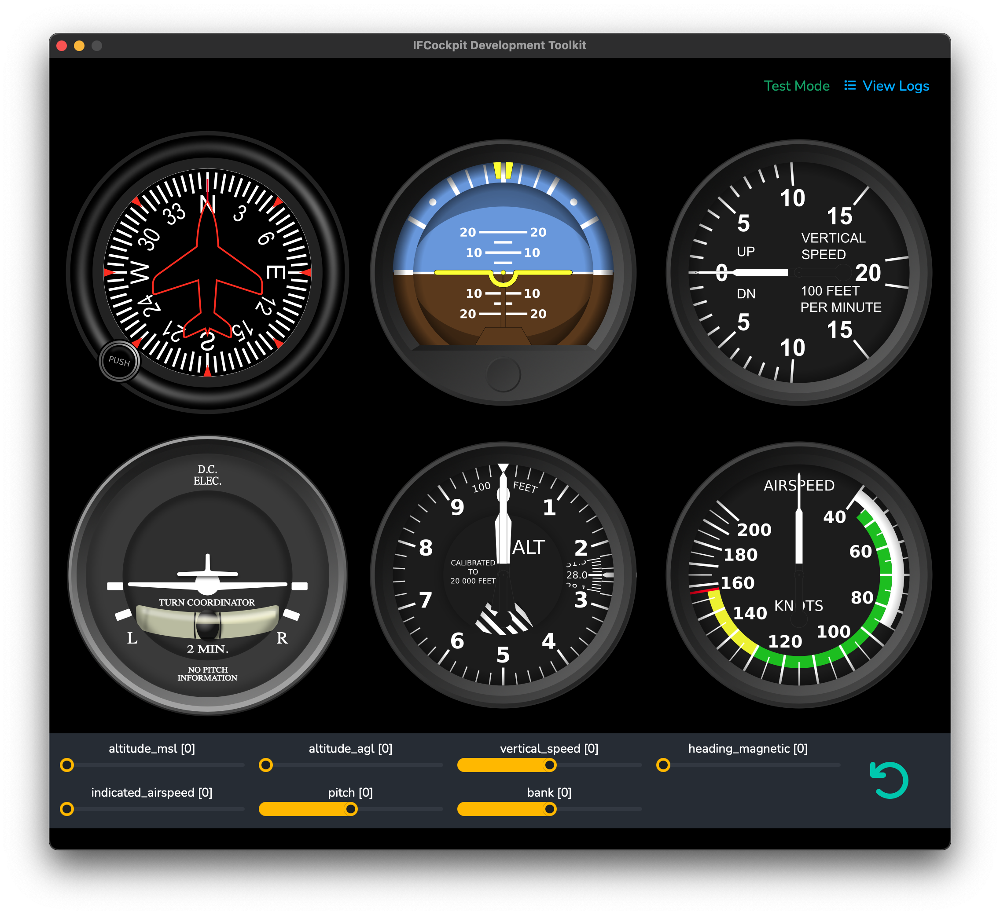

# IFCockpit Development Toolkit

This toolkit supports third-party developers in developing cockpit panels for the IFCockpit application from Canadian Seagull Studios Ltd. This toolkit allows developers to test their panels before submitting them to Canadian Seagull Studios for review and inclusion in IFCockpit.

This is not open source and may only be used by developers who are part of the IFCockpit developer programme under the terms of the programme and may not be shared with anyone outside the terms of that programme or otherwise without the explicit written consent of Canadian Seagull Studios. Contact Canadian Seagull Studios at info@canadianseagulls.com for mor einformation on the developer programme.

Copyright 2024, Canadian Seagull Studios Ltd. All rights reserved.

## Requirements

IFCockpit is a macOS desktop application built with the cross-platform [Wails](https://wails.io/) framework for building desktop apps using Web technology. IFCockpit uses [Svelte](https://svelte.dev/) as as its Web framework within Wails.

To use this toolkit to build a cockpit panel requires:

1. A Mac computer running macOS Sonoma or Sequoia
2. Familiarity build Web applications using Svelte along with HTML, CSS and Javascript
3. XCode command intalled along with its command line tools
4. [Go](https://go.dev/), [Wails](https://wails.io/) and NPM installed

## Installing Dependencies: Preparing Your Mac to use the Toolkit

Before downloading the toolkit, several steps are needed to set up your Mac:

1. Install Go
2. Install NPM
3. Install the XCode command-line tools
4. Install Wails

### Installing Go

Download Go for your Mac from the official download page: https://go.dev/dl/.

Once downloaded, follow the installation instructions here: https://go.dev/doc/install.

Once installed, start a new terminal window and verify that your `PATH` includes `~/go/bin` with this command:

```shell
echo $PATH | grep go/bin
```

### Installing NPM

NPM is the package manager which comes with Node.js. You can download Node (including NPM) if you need it here: https://nodejs.org/en/download/package-manager.

### Installing the XCode Command-Line Tools

First make sure you have the latest version of XCode installed on your Mac. You can find XCode in the macOS App Store.

You can then install the command-line tools with this command:

```shell
xcode-select --install
```

### Installing Wails

Once you have Go, NPM and the XCode command-line tools installed you can install Wails with this command:

```shell
go install github.com/wailsapp/wails/v2/cmd/wails@latest
```

For reference, the complete Wails installation instructions can be found here: https://wails.io/docs/gettingstarted/installation. These instructions include the steps above for installing Go, NPM and the XCode command-line tools.

Once you have Wails installed, you can verify it is installed with the minimum dependencies with this command:

```shell
wails doctor
```

This should output a verification report which completes with the following message:

```
SUCCESS  Your system is ready for Wails development!
```

## Setup

Once the dependencies are successfully installed, clone the IFCockpit Developers Toolkit Github repository:

```shell
git clone git@github.com:likeablegeek/ifcockpit-devtoolkit.git
```

Once you have clones the repository, change into the `frontend` subdirectory in the repository and install package dependencies with NPM:

```shell
npm i
```

## Setting up the `panel` Directory

In the toolkit you want to perform your panel component development in the directory `./frontend/src/panel/`. The repository does not contain this directory. However, a sample general aviation panel is in the directory `./frontend/src/sample/`.

To start your development, it is recommended to copy the `./frontend/src/sample/` to `./frontend/src/panel/`. The toolkit application will not run without a minimally compliant panel component in the `./frontend/src/panel/` directory.

You can copy the directory using the following command in the root directory of your cloned repository:

```shell
cp -a ./frontend/src/sample ./frontend/src/panel
``` 

## Using the Toolkit

To run the toolkit application to test your panel, use the following command in the root directory of the respository:

```shell
wails dev
```

This should build the application and launch it:


By default, the toolkit includes the default general aviation cockpit panel from IFCockpit as a reference and to allow you to test your installation of the toolkit is working before beginning your own panel development.

To make sure the toolkit is working, first make sure you enable the IF Connect API by selecting General > Enable Infinite Flight Connect in the Infinite Flight settings. Next, check the IP address of your Infinite Flight device.

Once done, simply enter that IP address in the IFCockpit Developer Toolkit app and click connect. It should indicate a successful connection and the panel instruments should respond to changes in your flights altitude, airspeed, vertical speed and so on.

### Using Test Mode

In addition to connecting to Infinite Flight and testing your panel while flying, you can use the toolkit's test mode to test how your panel reacts to the following Infinite flight states without connecting to Infinite Flight:

* `aircraft/0/altitude_msl`
* `aircraft/0/altitude_agl`
* `aircraft/0/vertical_speed`
* `aircraft/0/heading_magnetic`
* `aircraft/0/indicated_airspeed`
* `aircraft/0/pitch`
* `aircraft/0/bank`

States are the data points you can monitor and/or manipulate in Infinite Flight through the [Infinite Flight Connect v2 API](https://infiniteflight.com/guide/developer-reference/connect-api/overview). You can see a list of all states by aircraft here: https://infiniteflight.com/guide/developer-reference/connect-api/version-2-states.

To enable Test Mode click the `Test Mode` button in the top-right of the toolkit window. Test Mode controls will appear below the panel and allow you to interactively change the value of any of these states to see how your panel reacts:



## Panel Development

In simple terms, a cockpit panel in IFCockpit is nothing more than a [Svelte component](https://svelte.dev/docs/svelte-components). This documentation assumes you are comfortable with Svelte and how to create components.

In the toolkit you want to perform your panel component development in the directory `./frontend/src/panel/`. If you followed the setup step to copy `./frontend/src/sample/` to this directory then you will see the directory containing the sample general aviation panel like this:


The only required file in your component is `Panel.svelte`. Beyond that you can include any additional images or other resources or create additional components which you then include in `Panel.svelte`. In the case of the sample general aviation panel, there are six "sub-components" in sub-directorys (`ifcc-airspeed`, `ifcc-altimeter`, etc) which are all imported into the main `Panel.svelte` component:

```js
// Import all instruments used by the panel
import Vertspeed from './ifcc-vertspeed/Instrument.svelte';
import Heading from './ifcc-heading/Instrument.svelte';
import Airspeed from './ifcc-airspeed/Instrument.svelte';
import Altimeter from './ifcc-altimeter/Instrument.svelte';
import Turncoord from './ifcc-turncoord/Instrument.svelte';
import Horizon from './ifcc-horizon/Instrument.svelte';
```

Any images, resources, Svelte components or other files outside your `Panel.svelte` file must exist within the `./frontend/src/panel/` directory. You are free to create subdirectories within this directory as needed when developing your component.

The minimum requirements for your component are:

1. You must import `onMount` and `createEventDispatcher` from `svelte`
2. You must export placeholder variables `states` and `previous`
3. You must export a function called `getStates` which returns an array of strings containing a list of Infinite Flight state names which are needed by your panel
4. When your component mounts, use `onMount` to dispatch a `panelloaded` event

This looks something like this strawman example of the `<script>` block in `Panel.svelte`:

```js
import { onMount } from 'svelte';
import { createEventDispatcher } from 'svelte';

const dispatch = createEventDispatcher();

// Panel needs to receive states and previous objects from main App.svelte
export let states;
export let previous;

// Holds references to instantiated instruments
const instruments = {};

// Function to provide list of states required to App.svelte
export function getStates() {

    // Return an array of strings containing a list of IF state names.
    // You can return a static array or build an array programatically
    // such as in the general aviation example which builds the list
    // from the imported instrument components. The approach is your choice.

    return someArray;
    
}

// Dispatch a panelloaded event to inform IFCockpit your panel is ready
onMount(function() {
    dispatch("panelloaded",{ state: true });
});
```

How you build the user interface and logic of your component is entirely at your discretion within the context of this Svelte component.

It is important to keep in mind that your component is being rendered ultimately within a macOS webview component  -- which means the version of that webview will differ based on the version of macOS the user is running. You should keep this in mind for any testing of your panel.

### The `states` Object

The `states` object is used by IFCockpit to pass the values of Infinite Flight states into a panel. It will contain a set of key-value pairs where the key is the full Infinite Flight name of a state (such as `aircraft/0/bank`) and the value is the raw value returned by Infinite Flight in the relevant data type (integer, floating point number, string, boolean, etc.). It is the responsibility of your panel logic to transfer this value as required.

### The `previous` Object

When IFCockpit receives a new value for a state it first copies the current value from the `states` object to the the `previous` object then updates that value in the `states` object. This means you can use the `previous` object to obtain the last value of a state when a state value changes. This supports use cases where a panel's behaviour is determined in part by the nature of the change in a state's value (such as a heading crossing from just below 360 degrees to just above 0 degrees).

Like the `states` object, the `previous` object contains a set of key-value pairs where the key is the name of the state.

### Generating Log Messages

While for development purposes you can log messages to the Javascript console with `console.log()`, your final panel should not use `console.log` for logging messages. Rather, it is recommended to use the in-built logging mechanism in IFCockpit which relies on dispatching a Svelte event from your component through the `logmsg` event as in:

```js
dispatch("logmsg","A log message as a string");
```

Ultimately this will display in the Javascript console when running your panel in a development environment but will be handled differently in the production IFCockpit application without any code changes in your panel.

For this reason, it is recommended to simply use this event dispatching method for generating log messages instead of `console.log()` when developing your panel.

### Setting Infinite Flight States

IFCockpit provides panel developers with the ability to set state values in Infinite Flight for states which can be set via the IF Connect API.

To do this, your panel component needs to emit a `setstate` value passing in an object containing a state name and value as in this example:

```js
dispatch("setstate", {
    state: "api_joystick/buttons/1/value",
    value: 1
});
```

The value you send to the relevant state must be in the right type and unit value as expected by Infinite Flight. IFCockpit provides no logic for managing this and panel develoeprs should send appropriate values to Infinite Flight.

Please note that the general aviation panel example provided in this toolkit does not provide an example of using the `setstate` event to set an Infinite Flight state.

### Accessing Browser Developer Tools

In Wails, the front end user interface of the macOS desktop application is being rendered in a macOS webview component. Accordingly, you have access to a standard suite of browser developer tools as you would expect to find in browsers such as Safari or Chrome.

The simplest way to access these developer tools is to right click anywhere in the user interface of your panel and select `Inspect Element`. This will open developer tools within the toolkit window:


### Tailwind CSS

The user interface of IFCockpit is built partially on top of [Tailwind CSS](https://tailwindcss.com/) which means that Tailwind's helper classes for styling, formatting and layout are available to you if needed in your component.

You can also write your own CSS within your component as you can with any Svelte component.

Additionally, IFCockpit uses the [daisyUI](https://daisyui.com/) Tailwind component component library so its components are also available to you. 